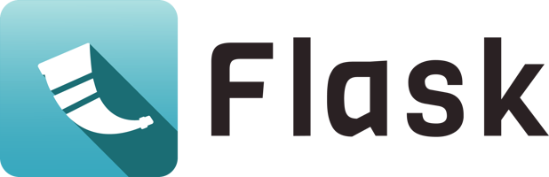

.. rst-class:: hide-header

Bem-vindo à Flask
================

Bem-vindo à documentação da Flask. Começa com a :doc:`installation` e depois tenha uma perspetiva geral com a :doc:`quickstart`. Também existe uma :doc:`tutorial/index` mais detalhada que mostra como criar uma pequena mas completa aplicação com a Flask. Os padrões comuns são descritos na seção :doc:`patterns/index`. O resto da documentação descreve cada componente da Flask em detalhes, com uma referência completa na seção :doc:`api`.

A Flask depende do conjunto de ferramentas de WSGI `Werkzeug`_, o motor de modelos de marcação `Jinja`_, e o conjunto de ferramentas de interface de linha de comando `Click`_. Certifica-te de consultar as suas documentações assim como a da Flask quando procurares por informação.

.. _Werkzeug: https://werkzeug.palletsprojects.com
.. _Jinja: https://jinja.palletsprojects.com
.. _Click: https://click.palletsprojects.com

Guia do Utilizador
------------

A Flask fornece configuração e convenções, com padrões sensíveis, para começar. Esta seção da documentação explica as diferentes partes da abstração Flask e como podem ser usadas, personalizadas, e estendidas. Além da própria Flask, procure por extensões mantidas pela comunidade para adicionar ainda mais funcionalidade.

.. toctree::
   :maxdepth: 2

   installation
   quickstart
   tutorial/index
   templating
   testing
   errorhandling
   debugging
   logging
   config
   signals
   views
   lifecycle
   appcontext
   reqcontext
   blueprints
   extensions
   cli
   server
   shell
   patterns/index
   security
   deploying/index
   async-await

Referência da API
-------------

Se estiveres a procurar por informação sobre uma função, classe ou método específico, esta parte da documentação é para ti.

.. toctree::
   :maxdepth: 2

   api

Notas Adicionais
----------------

.. toctree::
   :maxdepth: 2

   design
   extensiondev
   contributing
   license
   changes
